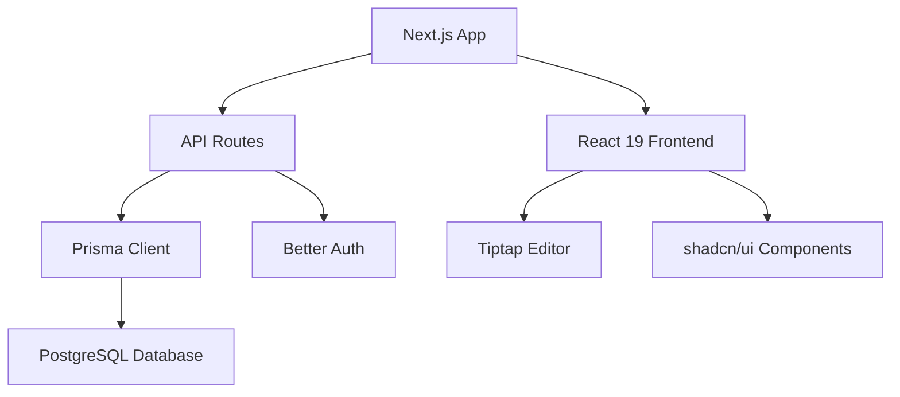

## What is Jottar?

Jottar is a modern SaaS note-taking application that combines powerful features with a clean, intuitive interface. Built with cutting-edge web technologies, Jottar provides a seamless experience for capturing, organizing, and managing your notes across web and mobile platforms.

## Key features

Jottar offers a comprehensive set of features designed to enhance your note-taking workflow:

### Rich text editing
- **Tiptap editor** with full formatting support
- Bold, italic, strikethrough text styling
- Code blocks and inline code
- Bulleted and numbered lists
- Blockquotes and horizontal rules
- Heading levels (H1-H4)

### Organization tools
- **Folders** - Group notes by topic, project, or theme
- **Tags** - Add multiple tags to notes for flexible categorization
- **Pin notes** - Keep important notes at the top
- **Favorites** - Mark notes for quick access
- **Archive** - Hide notes without deleting them
- **Trash** - Soft-delete notes with automatic cleanup

### Collaboration
- Share notes with customizable permissions
- Duplicate notes for templates and reuse
- Copy functionality for shared content

### Modern stack
- **Frontend**: Next.js 16 with React 19
- **Database**: PostgreSQL with Prisma ORM
- **Authentication**: Better Auth with email/password and Google OAuth
- **API**: RESTful endpoints for web and mobile
- **Styling**: Tailwind CSS with shadcn/ui components

## Architecture overview

Jottar is built as a full-stack Next.js application with the following architecture:



### Core technologies

<CardGroup cols={2}>
  <Card title="Frontend" icon="react">
    - Next.js 16.1.1 with App Router
    - React 19.2.3 with Server Components
    - TypeScript for type safety
    - Tailwind CSS 4 for styling
  </Card>
  
  <Card title="Backend" icon="database">
    - Prisma 6.19.0 ORM
    - PostgreSQL database
    - RESTful API architecture
    - Server Actions for mutations
  </Card>
  
  <Card title="Authentication" icon="lock">
    - Better Auth 1.4.6
    - Email/password authentication
    - Google OAuth (configurable)
    - Session-based auth with cookies
  </Card>
  
  <Card title="Editor" icon="pen-tool">
    - Tiptap 3.15.3 rich text editor
    - StarterKit extensions
    - Real-time auto-save to localStorage
    - JSON-based content storage
  </Card>
</CardGroup>

## Who should use Jottar?

Jottar is ideal for:

- **Developers** who want to study a modern Next.js application architecture
- **Teams** looking for a self-hosted note-taking solution
- **Individuals** who need a powerful, privacy-focused note app
- **Students** organizing research and study materials
- **Content creators** managing ideas and drafts

<Note>
  Jottar is open-source and can be self-hosted, giving you full control over your data and customization options.
</Note>

## Database schema

Jottar uses a relational database with the following core models:

- **User** - User accounts with email and OAuth support
- **Note** - Rich text notes with metadata (pinned, favorite, archived, trashed)
- **Folder** - Organizational containers for notes
- **Tag** - Flexible labeling system
- **NoteTag** - Many-to-many relationship between notes and tags
- **Account** - OAuth provider accounts
- **Session** - User authentication sessions

## API design

Jottar provides a comprehensive RESTful API with endpoints for:

- User management (`/api/me`)
- Notes CRUD operations (`/api/notes`)
- Folder management (`/api/folders`)
- Tag operations (`/api/tags`)
- Authentication (`/api/auth/[...all]`)

All API responses follow a consistent envelope pattern:

```json
// Success response
{ "ok": true, "data": { ... } }

// Error response
{ "ok": false, "error": "Error message" }
```

## Next steps

Ready to get started with Jottar?

<CardGroup cols={2}>
  <Card title="Quickstart" icon="rocket" href="/quickstart">
    Get up and running in 5 minutes
  </Card>
  
  <Card title="Installation" icon="download" href="/installation">
    Deploy Jottar to production
  </Card>
</CardGroup>
